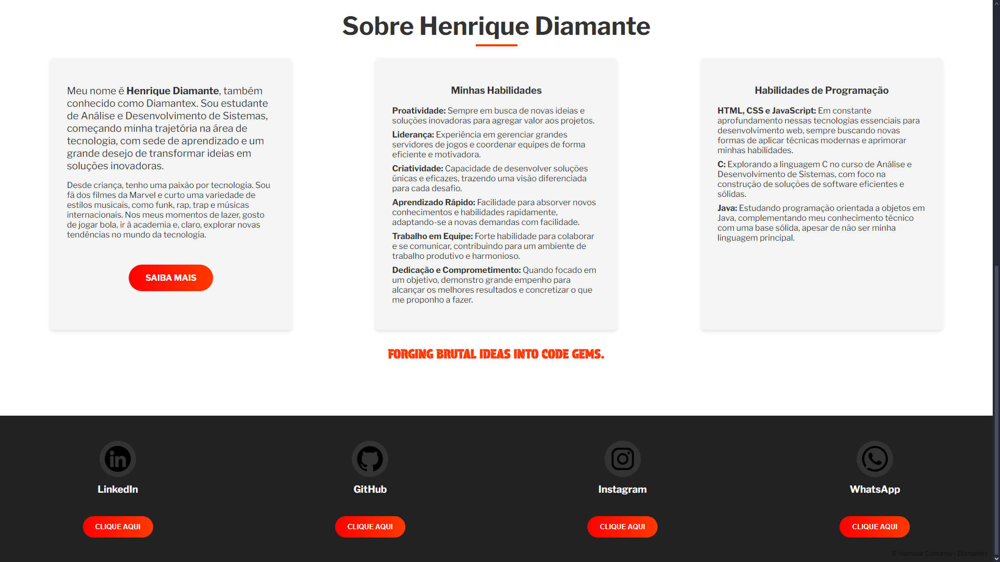

# Diamantex - Portfólio 

Portfólio pessoal de Henrique Diamante (Diamantex), onde compartilho minhas habilidades, projetos e trajetória na área de desenvolvimento de sistemas. Com um design moderno e responsivo, o site é uma introdução às minhas experiências e interesses em tecnologia.

## 🎬 Pré-visualização

Veja abaixo uma captura de tela do portfólio em funcionamento:




Ou, explore o site em [diamantex-portfolio.com](https://diamantex.github.io/portfolio).

## 📋 Funcionalidades

- **Banner de Apresentação**: Introdução com uma breve descrição pessoal e link para o LinkedIn.
- **Seção Sobre**: História, hobbies e informações sobre minha formação e paixão por tecnologia.
- **Habilidades e Competências**: Lista de habilidades em desenvolvimento, criatividade, liderança e tecnologias que estou estudando.
- **Contato e Redes Sociais**: Links para o LinkedIn, GitHub, Instagram e WhatsApp para facilitar a conexão.

## 🛠️ Tecnologias Utilizadas

- **HTML**: Estrutura e organização do conteúdo do portfólio.
- **CSS**: Estilo e design moderno, responsivo e interativo.

## 📂 Estrutura do Projeto

O projeto é composto pelos seguintes arquivos:

```plaintext
Portfolio/
├── css/
│   └── style.css        # Estilos e layout do portfólio
├── imgs/
│   └── ...              # Imagens e ícones do site
├── index.html           # Estrutura principal do portfólio
└── preview-1.png          # Imagem 1 de pré-visualização do projeto
└── preview-2.png          # Imagem 2 de pré-visualização do projeto
```

## 👤 Autor

Desenvolvido por [Diamantex](https://github.com/DiamantexDev).
